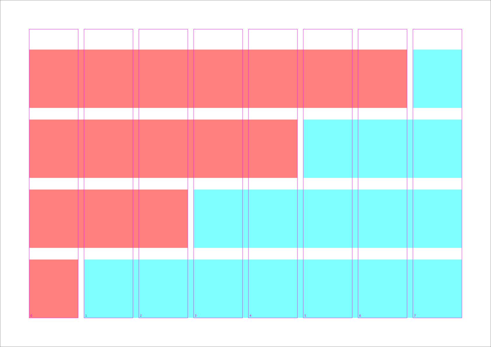
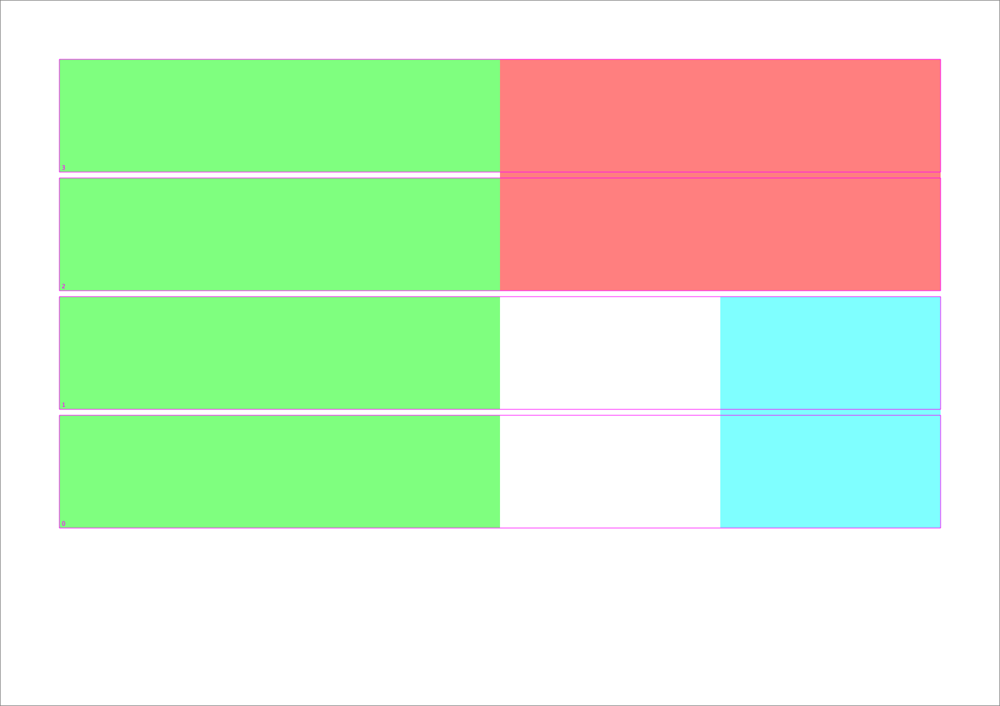
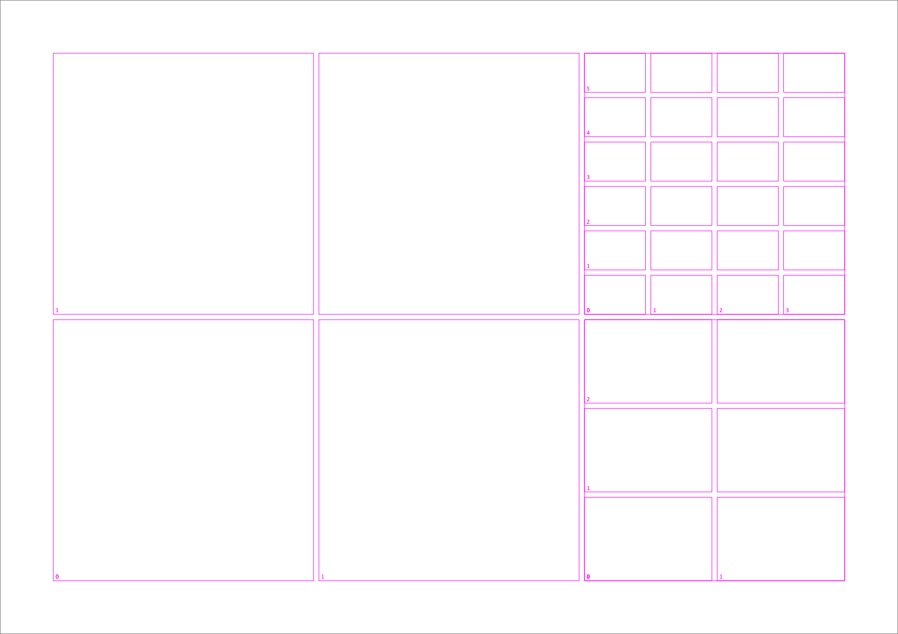
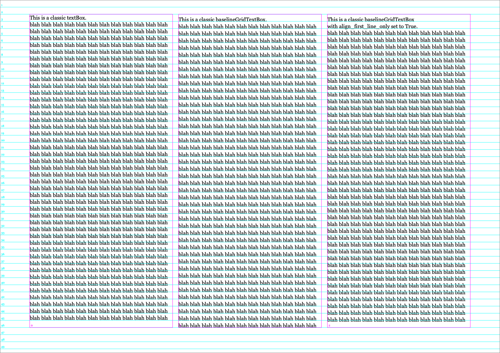
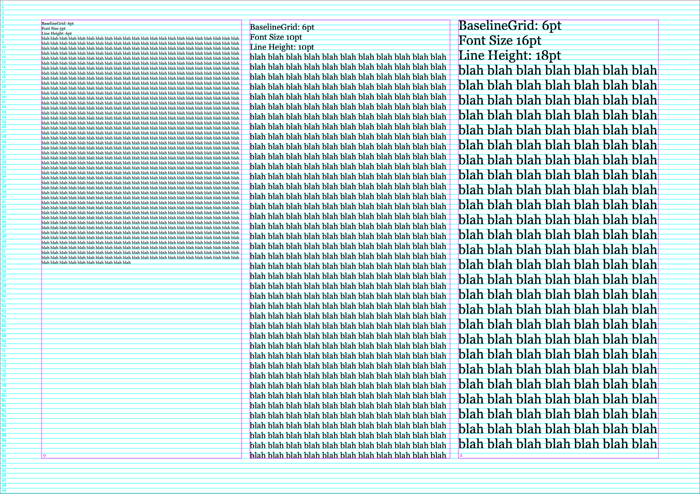

# drawBotGrid

**drawBotGrid** is a small library that make grid based layout easy in the always amazing [DrawBot](https://www.drawbot.com).


## install

In DrawBot, open the package manager with the menu Python -> Install Python Packages...

Enter the following url `git+https://github.com/mathieureguer/drawbotgrid` and press `go`.

For drawBot as a command line module, jsut enter the following terminal command: 
`pip install git+https://github.com/mathieureguer/drawbotgrid`


## ColumnGrid


`ColumnGrid((x, y, h, w), subdivisions=8, gutter=10)` divides the page in a given number of columns, separated by a gutter, making it easy to retrieve absolute x coordinates within the page.

`ColumnGrid` is callable by index, just like a list.  `ColumnGrid[2]` will return the y coordinate of the *left* of the third column.
Negative indexes works, `ColumnGrid[-1]` will return the y coordinate of *right* of the last column.

```python
from drawBotGrid import ColumnGrid

newPage("A4Landscape")

columns = ColumnGrid((50, 50, 742, 495), subdivisions=8, gutter=10)

fill(0, 1, 0, .5) # green
rect(columns[0], 450, 50, 50)
rect(columns[1], 450, 50, 50)
rect(columns[2], 450, 50, 50)
rect(columns[3], 450, 50, 50)
rect(columns[4], 450, 50, 50)
rect(columns[5], 450, 50, 50)

fill(0, 1, 1, .5) # cyan
rect(columns[-1], 250, -50, 50)
rect(columns[-2], 250, -50, 50)
rect(columns[-3], 250, -50, 50)
rect(columns[-4], 250, -50, 50)
rect(columns[-5], 250, -50, 50)
rect(columns[-6], 250, -50, 50)

columns.draw(show_index=True)
```


`ColumnGrid` is also multipliable. `ColumnGrid * 3` will return the width of 3 columns, including the 2 separating gutters. `ColumnGrid * 1` will return the width of a single column, with no gutter. Negative mutlipliers work as well. 

```python
from drawBotGrid import ColumnGrid

newPage("A4Landscape")

columns = ColumnGrid((50, 50, 742, 495), subdivisions=8, gutter=10)

fill(1, 0, 0, .5)  # red
rect(columns[0],  50, columns*1, 100)
rect(columns[0], 170, columns*3, 100)
rect(columns[0], 290, columns*5, 100)
rect(columns[0], 410, columns*7, 100)

fill(0, 1, 1, .5) # cyan
rect(columns[-1],  50, columns*-7, 100)
rect(columns[-1], 170, columns*-5, 100)
rect(columns[-1], 290, columns*-3, 100)
rect(columns[-1], 410, columns*-1, 100)

columns.draw(show_index=True)
```




Conviniently, instead of creating a `ColumnGrid` from its `(x, y, w, h)` coordinates, you can initiate it from its margin values relative to the document with `ColumnGrid.from_margint((left_margin, bottom_margin, right_margin, top_margin), subdivisions, gutter)`

`ColumnGrid.bottom`, `ColumnGrid.top`, `ColumnGrid.left`, `ColumnGrid.right`, `ColumnGrid.width`, `ColumnGrid.height` can be uses to access the relevant coordinates for the grid.

```python
from drawBotGrid import ColumnGrid

newPage("A4Landscape")

columns = ColumnGrid.from_margins((-20, -100, -20, -50), subdivisions=6, gutter=20)

fill(0, 1, 1, .5) # cyan
rect(columns[0], columns.bottom, columns*3, columns.height)
fill(0, 1, 0, .5) # green
rect(columns[3], columns.top, columns*3, columns.height*-.5)

columns.draw(show_index=True)
```


## RowGrid

`RowGrid((x, y, h, w), subdivisions=8, gutter=10)` divides the page in a given number of rows, separated by a gutter, making it easy to retrieve absolute y coordinates within the page. It works the same as `ColumnGrid` but for horizontal rows.


```python
from drawBotGrid import RowGrid

newPage("A4Landscape")

rows = RowGrid.from_margins((-50, -150, -50, -50), subdivisions=4, gutter=5)

fill(0, 1, 0, .5)  # green
for i in range(4):
    rect(rows.left, rows[i], rows.width*.5, rows*1)

fill(1, 0, 0, .5)  # red
rect(rows.right, rows[2], -rows.width*.5, rows*2)

fill(0, 1, 1, .5)  # cyan
rect(rows.right, rows[0], -rows.width*.25, rows*2)

rows.draw(show_index=True)
```




## Grid

`Grid((x, y, h, w),, column_subdivisions=8, row_subdivisions=8, column_gutter=10, row_gutter=10)` combines the powers of `ColumnGrid` and `RowGrid` in single object, for all your grid needs.

The underlying `ColumnGrid` and `RowGrid` can be accesed through `Grid.columns` and `Grid.rows`, repectiveley. 

```python
from drawBotGrid import Grid

newPage("A4Landscape")

grid = Grid.from_margins((-50, -50, -50, -50), 
                         column_subdivisions=8, 
                         row_subdivisions=8, 
                         column_gutter=5, 
                         row_gutter=5)

fill(0, 1, 0, .5)  # green
for i in range(8):
    rect(grid.columns[0], grid.rows[i], grid.columns*1, grid.rows*1)

fill(0, 1, 1, .5)  # cyan
for i in range(1, 8):
    rect(grid.columns[i], grid.rows[-1], grid.columns*1, grid.rows*-2)

fill(1, 0, 0, .5) # red
rect(grid.columns[1], grid.rows[0], grid.columns*3, grid.rows*6)

fill(1, 0, 1, .5) # pink
rect(grid.columns[4], grid.rows[3], grid.columns*3, grid.rows*3)

grid.draw(show_index=True)
```


If you're feeling adventurous, `Grid.column` and `Grid.row` can be called by a tuple of index directly/ `Grid[(1, 5)]` will return the coordinate of the column at index 1 and the row at index 5.

`Grid` can also be multiplied by a tupple. `Grid*(2, 4)` will return the width value of 2 columh and the height value of 4 ows (including the required gutters).

```python
from drawBotGrid import Grid

newPage("A4Landscape")

grid = Grid.from_margins((-50, -50, -50, -50), 
                         column_subdivisions=12, 
                         row_subdivisions=4, 
                         column_gutter=5, 
                         row_gutter=5)

fill(0, 1, 0, .5)  # green
rect(*grid[(0, 0)], *grid*(3, 4))

fill(1, 0, 0, .5)  # red
rect(*grid[(3, -2)], *grid*(6, -3))

fill(1, 0, 1, .5) # pink
rect(*grid[(3, -1)], *grid*(3, -1))

fill(0, 1, 1, .5)  # cyan
rect(*grid[(9, -2)], *grid*(3, -2))

grid.draw(show_index=True)
```


If you made it this far, you likely like grids, so we placed some grids inside your grid.

```python
from drawBotGrid import Grid

newPage("A4Landscape")

main_grid = Grid.from_margins((-50, -50, -50, -50), 
                         column_subdivisions=3, 
                         row_subdivisions=2, 
                         column_gutter=5, 
                         row_gutter=5)

sub_grid = Grid((main_grid.columns[2], main_grid.rows[1], main_grid.columns*1, main_grid.rows*1),
                column_subdivisions=4, 
                row_subdivisions=6, 
                column_gutter=5, 
                row_gutter=5)


other_sub_grid = Grid((main_grid.columns[2], main_grid.rows[0], main_grid.columns*1, main_grid.rows*1),
                       column_subdivisions=2, 
                       row_subdivisions=3, 
                       column_gutter=5, 
                       row_gutter=5)


main_grid.draw(show_index=True)
sub_grid.draw(show_index=True)
other_sub_grid.draw(show_index=True)
```




## BaselineGrid

`BaselineGrid((x, y, h, w), possize, line_height)` is a grid helper dedicated to text (it is limited to writing systems organised arround horizontal baselines).

Unlike `RowGrid`, `BaselineGrid` has no gutter and a fixed subdivison width.

Another notable difference is that folowing the top down direction of Latin text paragraphs, the first line,`BaselineGrid[0]` is a the top of the grid, rather than its bottom. 

```python
from drawBotGrid import BaselineGrid

newPage("A4Landscape")

baselines = BaselineGrid.from_margins((-50, -50, -50, -50), 
                         line_height=12)

fill(1, 0, 0, .5) # red
item_width = baselines.width / len(baselines)
for i in range(len(baselines)):
    rect(baselines.left+item_width*i, baselines[i], item_width, baselines*1)

baselines.draw(show_index=True)
```


## BaselineGridTextBox

`BaselineGrid`only becomes usefull if you can snap text to it. `BaselineGridTextBox(text, (x, y, w, h), baselineGrid, align_first_line_only=False, align="left")` is a `textBox` that takes a `BaselineGrid` object as an additonal argument. It will adjust the text `lineHeight` in order ot make it snap to the baseline grid.

```python
from drawBotGrid import ColumnGrid, BaselineGrid, baselineGridTextBox

newPage("A4Landscape")


baselines = BaselineGrid.from_margins((0, 0, 0, 0), 
                         line_height=12)
columns = ColumnGrid((50, baselines[-4], width()-100, baselines*-44), subdivisions=3)

fill(0)
font("Georgia")
fontSize(9)
textBox("This is a classic textBox.\n" + "blah "*1000, 
        (columns[0], columns.bottom, columns*1, columns.height))

baselineGridTextBox("This is a classic baselineGridTextBox.\n" + "blah "*1000, 
                    (columns[1], columns.bottom, columns*1, columns.height),
                    baselines)

baselineGridTextBox("This is a classic baselineGridTextBox\nwith align_first_line_only set to True.\n" + "blah "*1000, 
                    (columns[2], columns.bottom, columns*1, columns.height),
                    baselines,
                    align_first_line_only=True)

baselines.draw(show_index=True)
columns.draw(show_index=True)
```



`BaselineGridTextBox` will try to snap your defined `lineHeight` to the next multiple of its `BaselineGrid.line_height`. That mean you can use the same `BaselineGrid` for multiple size of text if you want to.

```python
from drawBotGrid import ColumnGrid, BaselineGrid, baselineGridTextBox

newPage("A4Landscape")

baselines = BaselineGrid.from_margins((0, 0, 0, 0), 
                         line_height=6)
columns = ColumnGrid((50, baselines[-8], width()-100, baselines*-88), subdivisions=3)

fill(0)
font("Georgia")
fontSize(5)
lineHeight(6)
baselineGridTextBox("BaselineGrid: 6pt\nFont Size 5pt\nLine Height: 6pt\n" + "blah "*1000, 
                    (columns[0], columns.bottom, columns*1, columns.height),
                    baselines)

fontSize(10)
lineHeight(10)
baselineGridTextBox("BaselineGrid: 6pt\nFont Size 10pt\nLine Height: 10pt\n" + "blah "*1000, 
                    (columns[1], columns.bottom, columns*1, columns.height),
                    baselines)

fontSize(16)
lineHeight(18)
baselineGridTextBox("BaselineGrid: 6pt\nFont Size 16pt\nLine Height: 18pt\n" + "blah "*1000, 
                    (columns[2], columns.bottom, columns*1, columns.height),
                    baselines)


baselines.draw(show_index=True)
columns.draw(show_index=True)
```




